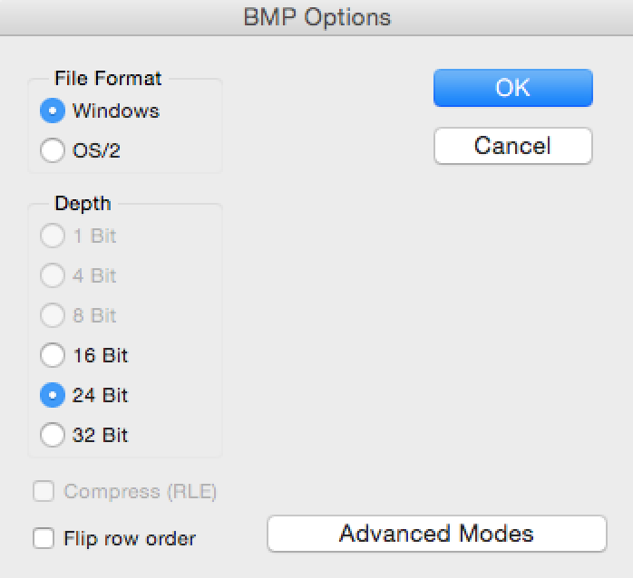

Arduino Light painter
=============


Light painting involves taking photographs at a long exposure in a dark area. Usually a DSLR is required for long exposure photography, but some modern point-and-shoot cameras also may have this feature.   
If you can set your shutter speed on your camera to a minimum of 10 seconds and can attach it to a tripod, you should be able to try light painting.     

##Aim   
The aim of this project was to create a simple, easy to build light painter using an Arduino and its onboard flash memory instead of external storage (like a micro-sd card). Although I have been light painting for years, I was inspired to try this project after reading [Adafruits guide](https://learn.adafruit.com/neopixel-painter/overview) on it and not having an SD card shield. I wanted to try and see if it was doable using the standard internal flash memory on an Arduino (which it turned out to be so).

##What do you need?
- **Camera** - Must support a shutter speed of at least 10 seconds, up to 30 seconds is preferable.   
- **Tripod** - A tripod of some way to keep the camera from moving is extremely important
- **Wood** - A long and thin piece of wood works great. Mine was an offcut and measures 1.2m. I wouldn't recommend any less than 1.1m so you have space for your electronics.
- **Rubber bands** - A collection of small rubber bands to hold everything together.   

###Electronics   
- **Arduno** - An Arduino Uno will work, although is limited by built in memory. An Arduino Uno can hold  9120 pixels (27360 array items).   
An Arduino Mega (2560) on the other hand can store roughly 72,000 pixels (218,880 array items) so is more suitable for this project.
- **Neopixel strip** - A Neopixel strip or other WS2812B based strip. I used a [60 pixel 1 meter strip](http://www.adafruit.com/products/1461) but you could also use much higher density strips like [this 144 pixel per meter strip](http://www.adafruit.com/products/1461)!
- **Battery** - In my case, to keep it nice and simple, I used a USB battery pack.
- **Jumper cables** - A handful of jumper cables is useful, at least male to male.

###Optional
- **Small breadboard** - Used for the button.
- **Breadboard button** - Used with the breadboard to run the program. These are not needed as a jumper can just be used to make it look like a button on all the time.
- **10k resistor** - Used with the button.


##Building
 
**WARNING!** - Keep an eye on the heat of the regulator on the Arduino!
When driving 60 or more pixels at one time, it can get hot. Do not use for extended periods of time without separate power supply!   
   
1. Wire up as in the diagram below.  


2. Attach everything with rubber bands to your piece of wood.


##Code
The code for this project is generated using a Python script. The script is written for python 2.7 (uses Python Imaging Library). It should though work for Python 3 with an alternative imaging library.   
   
You will also need an image to display. The code is written to support 24 bit bitmap (.bmp) images. Note no compression is used, it is just the raw 24 bit pixel data.   
The settings used to export the images from Photoshop (CS6) are below. Similar settings should be available in other image editing programs.     
   
Grab the Python script from [here](LightPaintBuild.py). You may need to right click, save link as.   
Then open it in your python program of choice (like IDLE 2).  
   
###Configuration options
There are a number of configuration options you will need to edit depending on your setup in the python program.   
- **Pixels** - This is the number of Neopixels you will be using. The default is ```pixels = 60```.  
- **Length** - This is the length of the arrays you want to use. It must be devisable by pixels. The default is ```length = 10920``` which is suitable for 60 Neopixels. The theoretical maximum is ```length = 10922```.     
- **Delay** - This is the delay between each line change in the image. It is in milliseconds. The default is ```delay = 100``` which is suitable for most setups.
- **File** - This is the path to the image file you wish to use. Remember it must be a .bmp file formatted as described above.   

##Running
Once you have the code setup correctly, run the python script. If there is any errors they should explain what is wrong.   
If all ran correctly, copy the output into a blank Arduino program.   
   
**Note** - Using [Arduino IDE 1.5.8](http://arduino.cc/en/Main/Software) (beta) or above is highly recommended as some features may not work in version 1.0.6 or earlier.   
   
Now just upload the code and the LEDs should start displaying the pattern from your image. Note some colours may be slightly off, you can adjust your image to counter this.   

##Photographing
To photograph using the light painter, you need to set up your camera. It is impossible for me to provide all the settings required, but here are a few tips.
- Set shutter speed to 10 seconds or higher! 30 seconds is usually worth trying first.   
- Use a tripod! You must use a tripod or some other method to keep the camera from moving.   
- Use a remote shutter release cable or the timer on the camera to reduce shaking when you hit the shutter button. Most cameras come with at least a 10 second timer, use this.
- If the image is too bright, drop the exposure compensation (maybe to -3EV or -4EV).
- If possible, drop your ISO to as low as it can go, to reduce grain/noise in the image.   
- If all else fails, switch to full manual and play about with the settings.     

##Results and feedback
If you end up with any great photographs, I would love to see them! Tweet them to me! [Twitter](http://twitter.com/gbaman1).   
Finally, if you have any extra questions or find issues in this guide, please open an [issue](https://github.com/gbaman/Light-painter/issues) or drop me a tweet.


